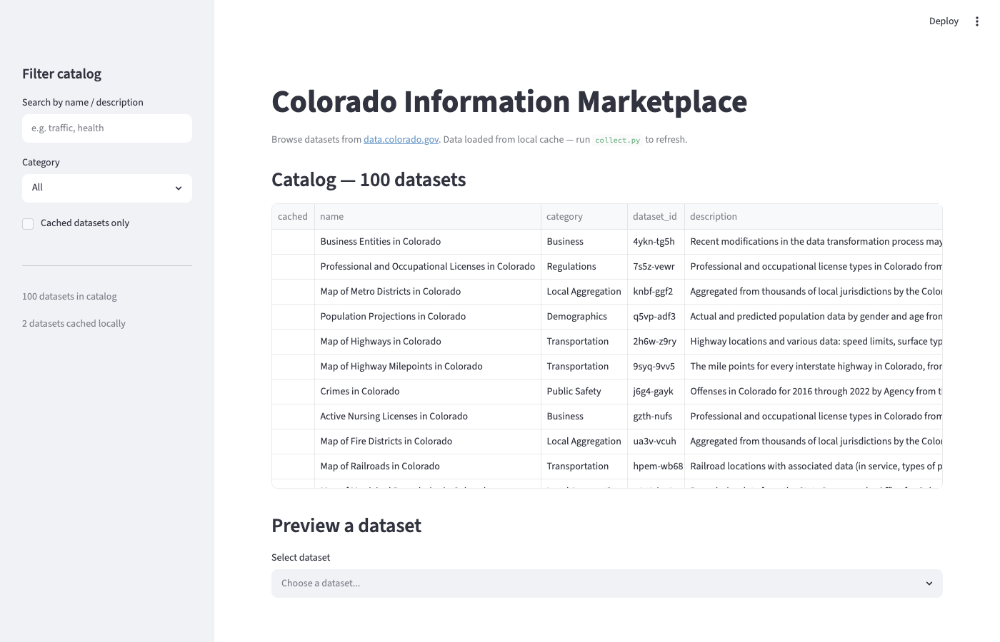
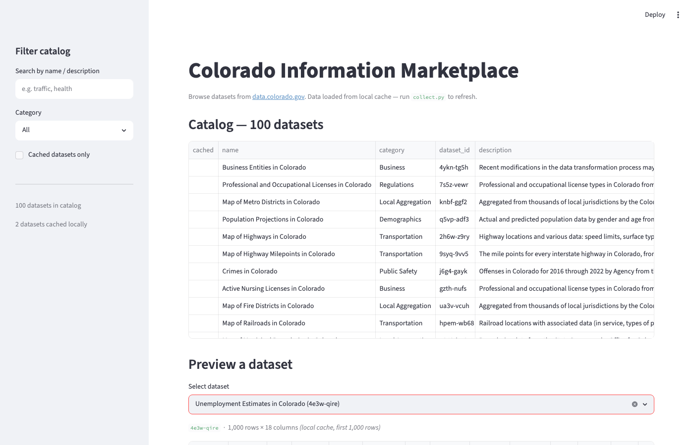
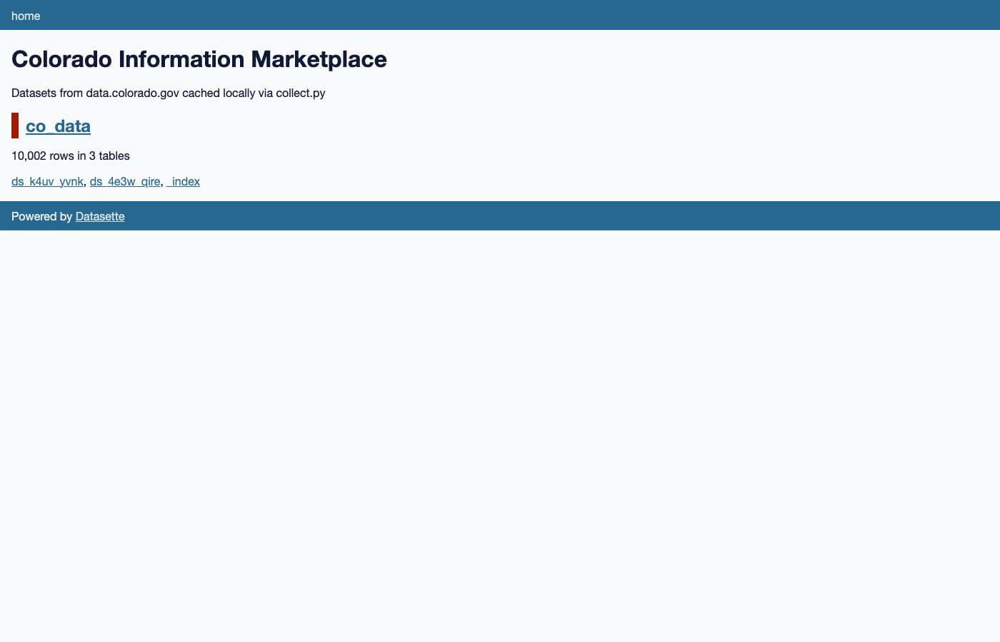
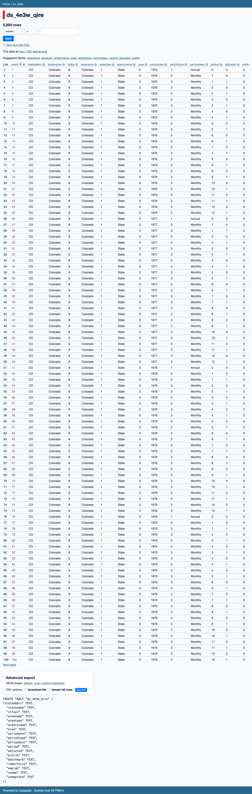

# co-data-skimmer

Browse and preview datasets from the [Colorado Information Marketplace](https://data.colorado.gov) — three frontend implementations over a shared local cache.

## Frontends

| App | Command | Best for |
|-----|---------|----------|
| **Marimo** | `uv run marimo edit app_marimo.py --port 2718` | Exploration — interactive notebook, cache-on-read |
| **Streamlit** | `uv run streamlit run app_streamlit.py` | Browsing — AgGrid column filters, GCP Cloud Run |
| **Datasette** | `uv run datasette serve data/co_data.sqlite --metadata datasette.yml` | Ad-hoc querying, filtering, CSV export |

## Screenshots

### Streamlit — catalog with AgGrid column filters


### Streamlit — dataset preview


### Datasette — home


### Datasette — browsing a dataset


## Quickstart

```bash
git clone https://github.com/hhm-gh/co-data-skimmer
cd co-data-skimmer
uv sync

# Download the full catalog (2,257 datasets → parquet + DuckDB + markdown)
uv run collect.py --catalog

# Fetch a couple of datasets into local cache
uv run collect.py --fetch 4e3w-qire   # Unemployment Estimates
uv run collect.py --fetch k4uv-yvnk   # Current Notaries

# Export to SQLite for Datasette
uv run collect.py --export

# Launch any frontend
uv run streamlit run app_streamlit.py
uv run marimo edit app_marimo.py --port 2718
uv run datasette serve data/co_data.sqlite --metadata datasette.yml
```

> **Tip:** Both Marimo and Streamlit support cache-on-read — clicking an uncached dataset
> fetches 1,000 rows from the API, saves them to DuckDB, and shows the total row count.
> No need to run `--fetch` manually for exploration.

## Data collection

`collect.py` is the only piece that talks to the network. Everything else reads from `data/`.

```bash
# Download the full catalog (default — also runs with no flags)
uv run collect.py --catalog

# Ad-hoc search (display only — does not write files)
uv run collect.py --search "traffic crashes"

# Fetch a dataset into local cache (default 50k rows)
uv run collect.py --fetch <dataset_id>

# Fetch all rows (can be very large — check total row count first)
uv run collect.py --fetch <dataset_id> --rows 0

# Fetch multiple datasets at once
uv run collect.py --fetch <id1> --fetch <id2>

# Export DuckDB → SQLite for Datasette (re-run after each new fetch)
uv run collect.py --export

# Works with any Socrata portal
uv run collect.py --domain data.cdc.gov --catalog
uv run collect.py --domain data.cdc.gov --search "covid"
```

> **Note:** The `cached` column (✓ markers) reflects which datasets were in DuckDB at the time
> `--catalog` last ran. Re-run `--catalog` after fetching new datasets to refresh it.

## Architecture

```
collect.py          CLI — Socrata API → local cache (only network-touching component)
store.py            Shared read layer (all frontends import this)
app_marimo.py       Marimo notebook — DuckDB catalog + cache-on-read API fallback
app_streamlit.py    Streamlit app — AgGrid catalog table, cache-on-read, GCP-deployable
datasette.yml       Datasette metadata config
Dockerfile          Cloud Run image for Streamlit
data/               Local cache (git-ignored)
  catalog.parquet       Full catalog (all datasets)
  catalog.md            Full catalog as a markdown table (sorted by category → name)
  co_data.duckdb        catalog table + datasets as ds_<id> tables + _index registry
  co_data.sqlite        SQLite mirror for Datasette (via --export)
```

### _index table

DuckDB `_index` tracks metadata for every fetched dataset:

| column | description |
|--------|-------------|
| `dataset_id` | Socrata 4×4 ID |
| `name` | Human-readable name |
| `domain` | Source Socrata domain |
| `table_name` | DuckDB table name (`ds_…`) |
| `row_count` | Rows stored locally |
| `total_rows` | Total rows in the dataset (from `$select=count(*)`) |
| `col_count` | Columns stored |
| `fetched_at` | Timestamp of last fetch |

## GCP deployment (Streamlit)

The Streamlit app bundles `data/` into the Docker image at build time — no network calls at runtime.

```bash
# After populating data/ with collect.py:
./deploy.sh          # build + deploy to Cloud Run
./deploy.sh stop     # set 0% traffic (pause without deleting)
./deploy.sh start    # restore 100% traffic
./deploy.sh delete   # remove the service entirely
```

Re-build after running `collect.py` to publish updated data.

## Dependencies

- Python ≥ 3.14, [uv](https://docs.astral.sh/uv/)
- [`data-sources`](https://github.com/hhm-gh/data-sources) package (sibling repo, provides the Socrata connector)

```bash
# data-sources must be checked out alongside this repo
git clone https://github.com/hhm-gh/data-sources ../data-sources
```
